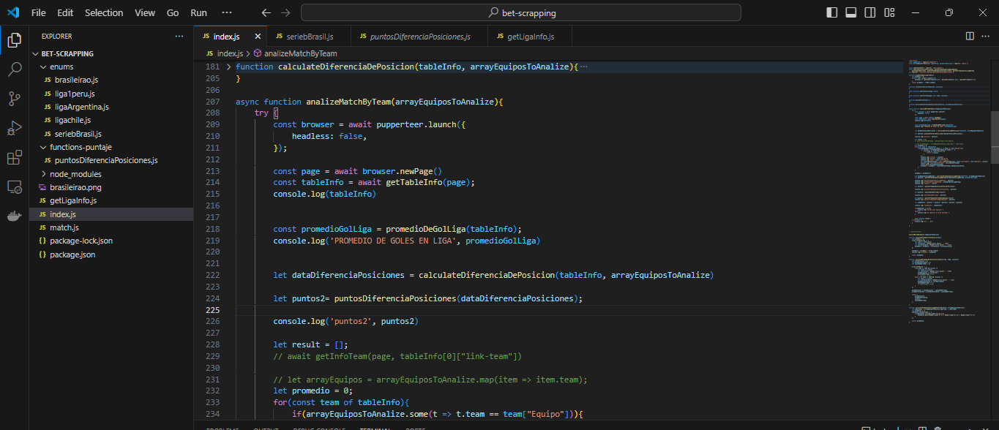

# Web Scrapping to Bet Analysis

## Description
This project was developed using Node.js and Puppeteer to analyze football matches: results, goals, match streaks, positions, among other things. Based on personal criteria and the collected information, I make the decision whether to bet on a match or not.

## Preview

Source code


Scrapping web


Result of analysis


Match config


Web page source of information: https://es.soccerway.com/ 


## How to install
1. Clone this repository:
   ```bash
   git clone https://github.com/MyPortfolio-Cesar/bet-scrapping
   ```
2. Install dependencies:
   ```bash
   npm install
   ```
3. Run the app:
   ```bash
   node index.js
   ```


